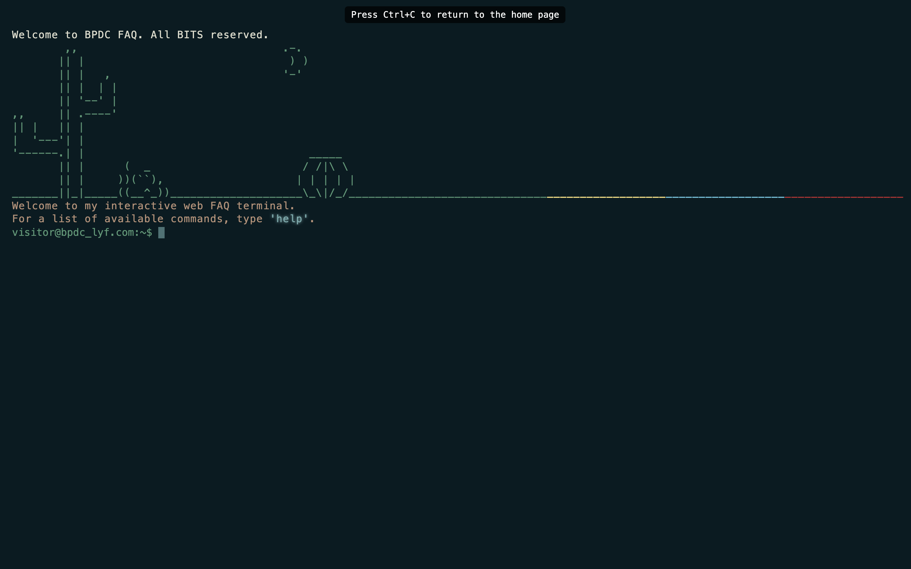

# Embrace the terminal lyf >_
discover answers to some of the intriguing questions students often face!
> Terminal-like website made for mediathon (MTC x Reflexions) @ BPDC <br>
> Theme: student life



## Setup Guidelines
### Fork and Clone
- Fork the repository using the `Fork` button and clone it using the following command:
```
git clone git:github@<YOUR_USERNAME>/BPDCfaq.git
cd BPDCfaq
```
